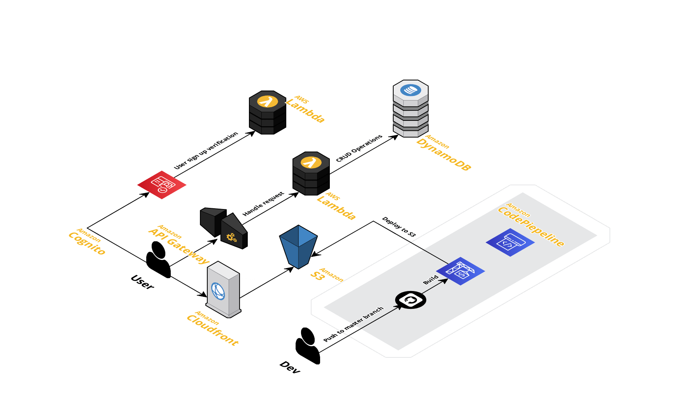

# NoNiche Blog Web App

After getting my AWS CCP I had great enthusiasim to learn how a full stack
 web application functioned on the cloud. In this project I used various common
 AWS services to build out a serverless blog application.

 http://serverless-blog-app1.s3-website-us-east-1.amazonaws.com/
 
 ## Tech Stack

 ### Frontend

- React
- MaterialUI
- Axios
- AWS Amplify

 ### AWS Services

- Lambda
- API Gateway
- S3
- DynamoDB
- Cognito

## App Architecture

